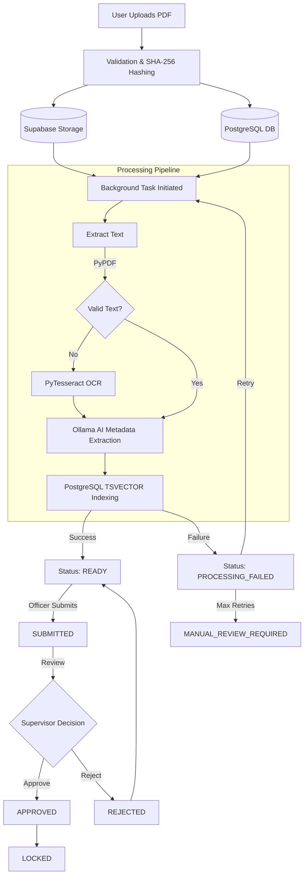
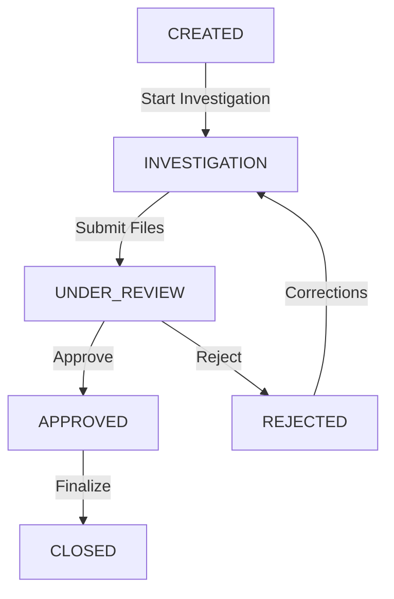
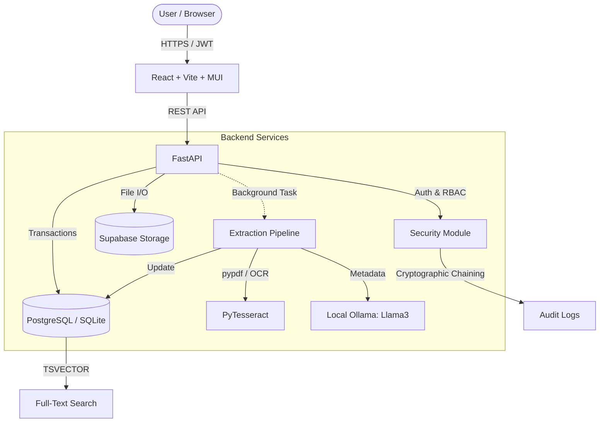

# Secure Document Management System

## 1. Project Overview

The Secure Document Management System (SDMS) is an advanced, highly secure web application designed to manage, process, and track sensitive investigation documents. It is intended for law enforcement agencies, intelligence units, legal firms, and government organizations that handle confidential cases and classified files. The system securely manages case files, evidence, witness statements, and reports, ensuring strict access control, cryptographic integrity, and comprehensive audit trails. Unlike normal document storage applications like Google Drive or Dropbox, SDMS enforces hierarchical role-based access control (RBAC), cryptographic audit chaining, integrity verification against tampering, and mandatory approval workflows to prevent unauthorized access or modification.

---

## 2. Problem Statement

Managing sensitive and confidential investigation documents presents unique challenges that standard file-management systems cannot solve. Traditional systems struggle with:
*   **Unauthorized access:** Sensitive files are often stored with broad permissions.
*   **Clearance levels:** Standard systems lack hierarchical classification (e.g., Secret vs. Top Secret).
*   **Case-based access:** Documents belong to specific cases and should only be accessed by assigned officers.
*   **Document tampering:** No guarantee that a downloaded PDF hasn't been maliciously altered.
*   **Lack of accountability:** Poor tracking of exactly who viewed or downloaded a file.
*   **Difficult document search:** Scanned PDFs are often unsearchable images.
*   **Controlled document approval:** Standard systems allow unilateral modification without oversight.

A normal file-management system is insufficient because it treats files as mere blobs of data. SDMS treats files as critical legal assets, applying strict access rules, extracting structured metadata using AI and OCR, maintaining immutable audit logs, and cryptographically verifying document integrity.

---

## 3. Key Features

1.  **Authentication:** Secure JWT-based authentication to verify user identity.
2.  **Basic Hierarchical RBAC:** Roles (Admin, Senior Officer, Investigating Officer, Prosecutor) combined with clearance levels (1 to 5) restrict unauthorized actions.
3.  **Case Management:** Organize documents into independent cases with distinct statuses (CREATED, INVESTIGATION, CLOSED) and ownership.
4.  **Case-Level Access Assignment:** Assign multiple specific users to a case to collaborate securely.
5.  **PDF Upload:** Secure upload, validation, and storage of PDF documents tied to specific cases.
6.  **SHA-256 Hashing:** Cryptographic hashing of document bytes at upload for tampering detection.
7.  **AI-Assisted PDF Extraction:** Automated pipeline using pypdf/pytesseract for OCR and local Ollama (Llama 3) for structured metadata extraction.
8.  **PostgreSQL Full-Text Search:** High-performance search using `TSVECTOR` and `websearch_to_tsquery` across document titles, text, and metadata.
9.  **Search Authorization Filtering:** Search results are strictly filtered at the database query level so users only see authorized matches.
10. **Document Versioning:** Maintain historical versions of a document with independent hashes and storage paths.
11. **Document Approval Workflow:** State machine enforcing review cycles (SUBMITTED -> UNDER_REVIEW -> APPROVED -> LOCKED).
12. **Audit Timeline:** Cryptographically chained, tamper-evident logging of every critical user action.
13. **Integrity Verification:** On-demand recalculation of SHA-256 hashes against stored files to detect tampering.
14. **Failure + Retry Handling:** Robust processing lifecycle that handles OCR/AI failures, auto-retries, and flags files for manual review.

---

## 4. Feature Implementation & Lifecycle

### 4.1 Authentication
The system uses JWT (JSON Web Tokens) for authentication. The frontend submits user credentials to `/auth/login`. The backend uses `passlib` (bcrypt) to verify the password hash. Upon success, an access token is generated with a 24-hour expiration. Authenticated requests include this token in the `Authorization` header, and the backend decodes it to identify the user for subsequent requests via the `get_current_user` dependency.

### 4.2 Basic Hierarchical RBAC
Roles are enforced using a dual-layer approach: Roles and Clearance Levels.
*   **Roles:** Admin, Senior Officer, Prosecutor, Investigating Officer.
*   **Clearance Levels:** 1 (Restricted) to 5 (Executive).
The `RoleChecker` dependency explicitly checks if a user's role grants specific permissions (e.g., `UPLOAD`, `APPROVE`). Furthermore, `check_document_access` ensures that the user's numeric clearance level is greater than or equal to the document's classification level.

### 4.3 Case Management
Cases act as logical containers for documents. A case is created with a unique `case_number`, `jurisdiction`, and an `owning_officer_id`. Cases follow a lifecycle (CREATED -> INVESTIGATION -> UNDER_REVIEW -> APPROVED -> CLOSED). Documents belong exclusively to a case, meaning access to the case heavily dictates access to its contents.

### 4.4 Case-Level Access Assignment
Beyond the `owning_officer_id`, admins can assign additional users to a case using the `CaseAssignment` table. Authorization checks explicitly query this table. If a user is not the owner and has no explicit assignment, they are barred from uploading or editing documents within that case, ensuring strict containment of sensitive investigations.

### 4.5 PDF Upload
Users upload PDFs to a specific case. The backend validates the `.pdf` extension. The file bytes are read into memory, hashed via SHA-256, and uploaded to a Supabase Storage bucket path (`<case_id>/<doc_id>/<version>.pdf`). A `Document` and `DocumentVersion` record are created in the database, setting the status to `PROCESSING`. A background task is then dispatched to perform text extraction.

### 4.6 SHA-256 Hashing
At the exact moment a file is uploaded (or a new version created), the raw bytes are hashed using the SHA-256 algorithm. This hash is permanently stored in the `DocumentVersion.file_hash` column. This creates a cryptographic baseline for the file, ensuring that any subsequent bit-level modification to the stored file will alter its hash and indicate tampering.

### 4.7 AI-Assisted PDF Extraction
The background processing task runs a multi-step extraction pipeline:
1.  **Text Extraction:** Attempts pure-Python text extraction using `pypdf`.
2.  **OCR Fallback:** If `pypdf` yields no text (e.g., scanned images), it falls back to `pdf2image` and `pytesseract` to perform Optical Character Recognition.
3.  **AI Metadata:** The raw text is sent to a local Ollama instance running `llama3`. The AI is prompted to return a structured JSON object extracting fields like FIR number, incident date, police station, and IPC sections. If Ollama fails or is unavailable, it falls back to a rule-based regex heuristic extractor.

### 4.8 PostgreSQL Full-Text Search
The database utilizes PostgreSQL's native full-text search capabilities. When a document is processed, its title, type, and AI-extracted metadata are combined into a `TSVECTOR` column (`search_vector`). The `/search/documents` endpoint converts user queries using `websearch_to_tsquery` and ranks results via `ts_rank`. A `ts_headline` snippet is also generated from the raw OCR text to show context.

### 4.9 Search Authorization Filtering
Search filtering happens securely at the database query level. The `get_authorized_document_filter` function returns a complex SQLAlchemy `or_` condition. It joins the `Case`, `DocumentPermission`, and `CaseAssignment` tables. The database only returns search hits for documents where the user meets the clearance level AND (owns the case, is assigned to the case, has explicit document permission, or the document is unrestricted Level 1).

### 4.10 Document Versioning
Documents are version-controlled via the `DocumentVersion` table. Each edit (e.g., uploading a revised report) generates a new `DocumentVersion` with an incremented version number (e.g., 1.0 -> 2.0). The physical file is stored in a separate path in Supabase Storage (`<version>.pdf`), and a new SHA-256 hash is computed. The main `Document` record updates its `current_version_id`. An endpoint allows authorized users to restore previous versions.

### 4.11 Document Approval Workflow
Documents follow a strict state machine: `READY` -> `SUBMITTED` -> `UNDER_REVIEW` -> `APPROVED` -> `LOCKED`.
*   Only users with the `SUBMIT` permission can move a document to `SUBMITTED`.
*   Only users with the `APPROVE` permission can approve or reject.
*   Crucially, if a user is the investigating officer of the case, they are blocked from approving their own documents (enforcing separation of duties) unless they are an Admin.

### 4.12 Audit Timeline
Every critical action (view, download, upload, status change, permission change) triggers the `log_audit_event` function. Audit logs are written to the `AuditLog` table. To ensure integrity, the logging uses cryptographic chaining: it locks the table (`FOR UPDATE`), retrieves the previous log's `current_hash`, and includes it in the canonical JSON payload of the new event. The new payload is hashed, creating a tamper-evident sequential blockchain of audit events.

### 4.13 Integrity Verification
The integrity verification endpoint retrieves the physical file from Supabase Storage, recalculates the SHA-256 hash of the raw bytes, and compares it against the `file_hash` stored in the `DocumentVersion` table. If the hashes match, the status is `VERIFIED`. If they differ, it is flagged as `TAMPERED`, updating the `is_tampered` boolean on the version record and logging a critical audit failure.

### 4.14 Failure + Retry Handling
If the background extraction pipeline fails (e.g., corrupt PDF, Ollama timeout), the document status is set to `PROCESSING_FAILED` and the error is saved to `failure_reason`. Authorized users can hit the `/retry` endpoint. The `retry_count` is incremented. If the retry count reaches 3, the document is permanently marked as `MANUAL_REVIEW_REQUIRED`, forcing administrative intervention.

---

## 5. End-to-End Document Lifecycle



---

## 6. Case Lifecycle

Cases manage the workflow of the overarching investigation. A closed case prevents further document edits or uploads.



---

## 7. System Architecture

The architecture consists of a decoupled frontend and backend.
*   **Frontend:** A React/Vite Single Page Application (SPA) utilizing Material UI for styling and axios for API communication.
*   **Backend:** A FastAPI asynchronous Python application. It handles routing, authorization, and background tasks.
*   **Database:** PostgreSQL (with SQLite fallback) accessed via SQLAlchemy ORM asynchronously. It stores relational data, TSVECTOR indexes, and JSON metadata.
*   **Storage:** Supabase Storage bucket (`SDMS`), structured hierarchically by Case ID and Document ID.
*   **Background Processing:** FastAPI `BackgroundTasks` handle heavy OCR and AI extraction asynchronously without blocking the HTTP response.
*   **AI/OCR:** `pytesseract` handles OCR, and a local Ollama instance processes the text for metadata.

---

## 8. Architecture Diagram



---

## 9. Technology Stack

*   **Frontend Framework:** React 19
*   **Build Tool:** Vite
*   **Programming Languages:** TypeScript (Frontend), Python 3 (Backend)
*   **UI Framework:** Material UI (`@mui/material`)
*   **Backend Framework:** FastAPI
*   **Database:** PostgreSQL (production target) / SQLite (development default)
*   **Database Driver:** `asyncpg` (PostgreSQL), `aiosqlite` (SQLite)
*   **ORM:** SQLAlchemy 2.0 (Async)
*   **Migration System:** Alembic
*   **Authentication Libraries:** `PyJWT`, `passlib`, `bcrypt`
*   **Storage Provider:** Supabase Storage (`supabase-py`)
*   **OCR Libraries:** `pypdf`, `pytesseract`, `pdf2image`
*   **AI Runtime:** Ollama (Local LLM API)
*   **Search Technology:** PostgreSQL TSVECTOR & TSQUERY
*   **Testing Tools:** `pytest`, `httpx` (AsyncClient)

---

## 10. Project Structure

```
DMS/
├── backend/
│   ├── alembic/                # Database migrations
│   ├── app/                    # Main application code
│   │   ├── api/                # API Route handlers (auth, cases, documents, search, admin)
│   │   ├── core/               # Core configuration, security, audit, authorization, storage
│   │   ├── services/           # Business logic (e.g., OCR & AI extraction)
│   │   ├── database.py         # DB connection and session setup
│   │   ├── main.py             # FastAPI entrypoint and lifespan events
│   │   └── models.py           # SQLAlchemy declarative models
│   ├── tests/                  # Pytest test suites
│   ├── alembic.ini             # Alembic configuration
│   ├── requirement.txt         # Python dependencies
│   ├── full_test.py            # Comprehensive API test script
│   └── .env                    # Environment variables
└── frontend/
    ├── src/
    │   ├── assets/             # Static assets
    │   ├── components/         # Reusable React components
    │   ├── context/            # React context (Auth)
    │   ├── pages/              # Page views
    │   ├── App.tsx             # Main React component
    │   ├── main.tsx            # React entrypoint
    │   └── theme.ts            # Material UI theme definitions
    ├── package.json            # NPM dependencies
    ├── vite.config.ts          # Vite bundler configuration
    └── tsconfig.json           # TypeScript configuration
```

---

## 11. Prerequisites

To run this system locally, the following software must be installed:
*   **Python:** 3.10+
*   **Node.js:** 18+ and `npm`
*   **PostgreSQL:** (Optional, SQLite is used by default if no URL is provided)
*   **Tesseract OCR:** Required for scanned PDF text extraction.
*   **Poppler:** Required by `pdf2image` to convert PDFs to images.
*   **Ollama:** Required for AI-assisted metadata extraction (with `llama3` model pulled).

---

## 12. Configuration

The application is configured primarily through environment variables and sensible defaults:
*   **Backend Configuration:** Handled by `pydantic-settings` in `app.core.config`. It manages database URLs, JWT secrets, and Ollama endpoint URLs.
*   **Database Configuration:** Connects to an asynchronous SQLite database (`dms.db`) by default.
*   **Storage Configuration:** Configured to use Supabase Storage, requiring valid `SUPABASE_URL` and `SUPABASE_SERVICE_KEY`.
*   **AI Configuration:** Assumes Ollama is running on `http://localhost:11434` with the `llama3` model.
*   **CORS Configuration:** `main.py` is configured to allow all origins (`*`) to support local Vite development.

---

## 13. Environment Variables

Create a `.env` file in the `backend/` directory. The application uses these variables:

| Name | Purpose | Required | Example |
| :--- | :--- | :--- | :--- |
| `DATABASE_URL` | Async database connection string. | No | `sqlite+aiosqlite:///./dms.db` |
| `STORAGE_TYPE` | Storage backend. | No | `local` |
| `STORAGE_LOCAL_DIR` | Path to local storage directory (Unused fallback). | No | `./storage` |
| `INITIAL_ADMIN_EMAIL` | Email for the default seeded admin. | No | `admin@gmail.com` |
| `INITIAL_ADMIN_PASSWORD` | Password for the default seeded admin. | No | `<PLACEHOLDER_PASSWORD>` |
| `SECRET_KEY` | Key for signing JWT tokens. | No | `<PLACEHOLDER_JWT_SECRET>` |
| `OLLAMA_BASE_URL` | URL of the local Ollama instance. | No | `http://localhost:11434` |
| `SUPABASE_URL` | Supabase endpoint for remote storage. | Yes | `<PLACEHOLDER_URL>` |
| `SUPABASE_SERVICE_KEY` | Supabase secret key for storage API. | Yes | `<PLACEHOLDER_KEY>` |

---

## 14. Installation

These instructions are strictly for local development setup.

1.  **Clone the repository:**
    ```bash
    git clone <repository_url>
    cd DMS
    ```
2.  **Backend Setup:**
    ```bash
    cd backend
    python -m venv venv
    # Windows
    venv\Scripts\activate
    # Linux/Mac
    source venv/bin/activate
    
    pip install -r requirement.txt
    ```
3.  **Prepare the Database & Storage:**
    The application utilizes SQLAlchemy's `create_all` during startup to build the schema automatically. Ensure your Supabase credentials are set in the `.env` file so the storage client can initialize.
4.  **Install OCR Dependencies (OS Specific):**
    *   *Windows:* Install Tesseract OCR and Poppler binaries, and add them to your system PATH.
    *   *Linux:* `sudo apt install tesseract-ocr poppler-utils`
    *   *Mac:* `brew install tesseract poppler`
5.  **Install AI Dependencies:**
    Install Ollama from `ollama.com` and run:
    ```bash
    ollama run llama3
    ```
6.  **Frontend Setup:**
    ```bash
    cd ../frontend
    npm install
    ```

---

## 15. Backend Startup

To start the FastAPI backend locally:

1.  Open a terminal in the `backend/` directory.
2.  Activate the virtual environment.
3.  Run the Uvicorn server:
    ```bash
    python -m uvicorn app.main:app --host 127.0.0.1 --port 8000 --reload
    ```
4.  The API will be available at `http://127.0.0.1:8000`.
5.  Interactive Swagger API documentation is accessible at `http://127.0.0.1:8000/docs`.

---

## 16. Frontend Startup

To start the React frontend locally:

1.  Open a terminal in the `frontend/` directory.
2.  Run the Vite development server:
    ```bash
    npm run dev
    ```
3.  The frontend will typically be accessible at `http://localhost:5173`.
4.  The frontend is configured (often via Axios instances) to communicate with the backend at port 8000.

---

## 17. Default Administrator Credentials

During the initial backend startup, the system's `lifespan` event automatically seeds a default administrator account into the database if one does not exist.

*   **Email:** `admin@gmail.com`
*   **Role:** `Admin`
*   **Clearance Level:** `5` (Executive)
*   **Password:** `admin` (Intended for local development only)

> [!WARNING]
> These credentials are hardcoded defaults for local development convenience. You **MUST** change the password and JWT secret immediately in any production or exposed environment.

---

## 18. API Endpoint Overview

### Authentication
*   `POST /auth/login` (Public): Authenticate and receive a JWT.
*   `GET /auth/me` (Auth): Get current user details.

### Cases
*   `GET /cases/` (Auth): List cases visible to the user.
*   `POST /cases/` (Auth, Admin/Officer): Create a new case.
*   `PATCH /cases/{case_id}/reassign` (Auth, Admin): Change case ownership.
*   `POST /cases/{case_id}/assignments` (Auth, Admin): Assign users to a case.
*   `PATCH /cases/{case_id}/status` (Auth, Owner/Admin): Update case status.

### Documents
*   `GET /documents/` (Auth): List authorized documents.
*   `POST /documents/upload` (Auth, Upload Perm): Upload a new PDF.
*   `GET /documents/{document_id}` (Auth, View Perm): Retrieve metadata.
*   `GET /documents/{document_id}/download` (Auth, Download Perm): Download the physical PDF.
*   `POST /documents/{document_id}/status` (Auth, Edit Perm): Execute workflow transitions (e.g., SUBMITTED).
*   `GET /documents/{document_id}/permissions` (Auth): View explicit permissions.
*   `POST /documents/{document_id}/permissions` (Auth, Owner/Admin): Share document.

### Versions & Integrity
*   `GET /documents/{document_id}/versions` (Auth, View Perm): List historical versions.
*   `POST /documents/{document_id}/versions` (Auth, Edit Perm): Upload a new version.
*   `POST /documents/{document_id}/versions/{version_id}/restore` (Auth, Edit Perm): Restore a past version.
*   `POST /documents/{document_id}/verify-integrity` (Auth): Verify SHA-256 hash against Supabase storage file.
*   `POST /documents/{document_id}/retry` (Auth): Retry a failed processing pipeline.

### Search
*   `GET /search/documents` (Auth): Secure full-text search.

---

## 19. Authentication & Authorization

Authentication is handled via JWT bearer tokens injected into requests.
Authorization is highly complex and handled by `app.core.authorization`:
1.  **Clearance Level Check:** A user's clearance level (1-5) must be `>=` the document's classification level. If not, access is strictly denied and a security audit event is logged.
2.  **Case Access:** A user gains access to a document if they own the parent Case (`owning_officer_id`) or have an explicit assignment in the `CaseAssignment` table.
3.  **Document Permissions (Sharing):** Admins and case owners can grant explicit `VIEW`, `DOWNLOAD`, or `EDIT` permissions to specific users on a per-document basis.
4.  **Admin Override:** Admins automatically bypass standard access checks.
5.  **State Restrictions:** Documents in a `CLOSED` case cannot be edited or uploaded. Users cannot approve their own documents unless they are an Admin.

---

## 20. Search Authorization

Because the search endpoint queries the entire database, authorization must be applied directly to the SQL query to prevent data leakage. The `get_authorized_document_filter()` function constructs a SQLAlchemy `or_` filter. This filter enforces that the SQL query only returns documents matching the user's explicit permissions, case assignments, case ownership, and clearance level. Consequently, unauthorized documents are filtered out at the database level before any results are paginated or returned to the frontend.

---

## 21. Document Versioning

The architecture cleanly separates `Document` (metadata) from `DocumentVersion` (physical file data).
*   Every upload creates a new `DocumentVersion` with a unique ID, hash, and physical file path.
*   The parent `Document` record maintains a `current_version_id` pointer.
*   Old versions are permanently retained in Supabase storage and the database.
*   The restore endpoint creates a *new* version copy using the old version's physical file, preserving the linear history of the document.

---

## 22. Audit Timeline

The `AuditLog` captures exactly *who* did *what* to *which* resource, and *when*.
*   Events like `DOCUMENT_VIEWED`, `DOCUMENT_UPLOADED`, and `UNAUTHORIZED_ACCESS_ATTEMPT` are captured.
*   The system uses **cryptographic chaining**. When logging an event, the database is locked to fetch the `current_hash` of the preceding record. This becomes the `previous_hash` of the new record. A new SHA-256 hash is computed over the payload. This forms a tamper-evident blockchain within the SQL database.

---

## 23. Integrity Verification

Sensitive documents must be protected against silent corruption or malicious tampering in remote storage.
The `/verify-integrity` endpoint automates this:
1.  Retrieves the expected `file_hash` from the database.
2.  Retrieves the actual physical file bytes from Supabase Storage.
3.  Recalculates the SHA-256 hash.
4.  Compares the hashes. If they differ, the document version is permanently flagged as `is_tampered=True`, and a high-severity `INTEGRITY_FAILURE` audit log is generated.

---

## 24. Failure and Retry Handling

Extracting text via OCR and AI is resource-intensive and prone to failure (e.g., Ollama crashing, timeout, corrupt PDF).
*   Upon failure, the document status degrades to `PROCESSING_FAILED` and the error is logged.
*   The file remains accessible, but metadata extraction halts.
*   Users can call the `/retry` endpoint, which increments the `retry_count` and requeues the background task.
*   If `retry_count` hits 3, the status locks into `MANUAL_REVIEW_REQUIRED`, preventing endless retry loops and signaling to an Admin that the file requires manual data entry or technical inspection.

---

## 25. Testing Methodology

Local API integration testing was performed comprehensively against the live running backend using `httpx` and an automated Python script (`full_test.py`). Tests utilized a seeded Admin account to perform non-destructive actions. 

The test script executed real HTTP requests to validate:
*   **Routing:** Invalid methods, public routes, and 401 unauthenticated access rejection.
*   **Authentication:** Valid and invalid login attempts.
*   **Case APIs:** Creating a dynamically named case and listing cases.
*   **Document APIs:** Uploading a mock PDF byte stream, retrieving document details, downloading the file, checking version lists, progressing the state machine to `SUBMITTED`, verifying integrity, and ensuring proper validation on retry logic.
*   **Search:** Verifying the search endpoint responds successfully with a test query.

---

## 26. Routing Testing Results

| Test | Expected Result | Actual Result | Status |
| :--- | :--- | :--- | :--- |
| Public login route (Accessible) | 401 (Invalid creds) | 401 | PASS |
| Protected route without JWT | 401 | 401 | PASS |
| Invalid route | 404 | 404 | PASS |
| Invalid method | 405 | 405 | PASS |

---

## 27. API Testing Results

| Test | Endpoint | Expected | Actual | Status |
| :--- | :--- | :--- | :--- | :--- |
| Invalid login | `POST /auth/login` | 401 | 401 | PASS |
| Valid login | `POST /auth/login` | 200 | 200 | PASS |
| Case creation | `POST /cases/` | 200 | 200 | PASS |
| Case retrieval | `GET /cases/` | 200 | 200 | PASS |
| Document upload | `POST /documents/upload` | 200 | 200 | PASS |
| Document retrieve | `GET /documents/{id}` | 200 | 200 | PASS |
| Document download | `GET /documents/{id}/download`| 200 | 200 | PASS |
| Document versions list | `GET /documents/{id}/versions`| 200 | 200 | PASS |
| Approval workflow - SUBMITTED | `POST /documents/{id}/status`| 200 | 200 | PASS |
| Integrity verification | `POST /documents/{id}/verify-integrity`| 200 | 200 | PASS |
| Retry behavior (when not failed) | `POST /documents/{id}/retry` | 400 | 400 | PASS |
| Search documents | `GET /search/documents` | 200 | 200 | PASS |

**Testing Summary:**
*   **Total tests executed:** 16
*   **Passed:** 16
*   **Failed:** 0
*   **Important findings:** The API robustly handles authentication boundaries and properly prevents invalid state transitions (e.g., retrying a non-failed document returns a clean 400 Bad Request rather than a 500 error). File upload parsing works correctly even with synthetically generated PDF bytes.
