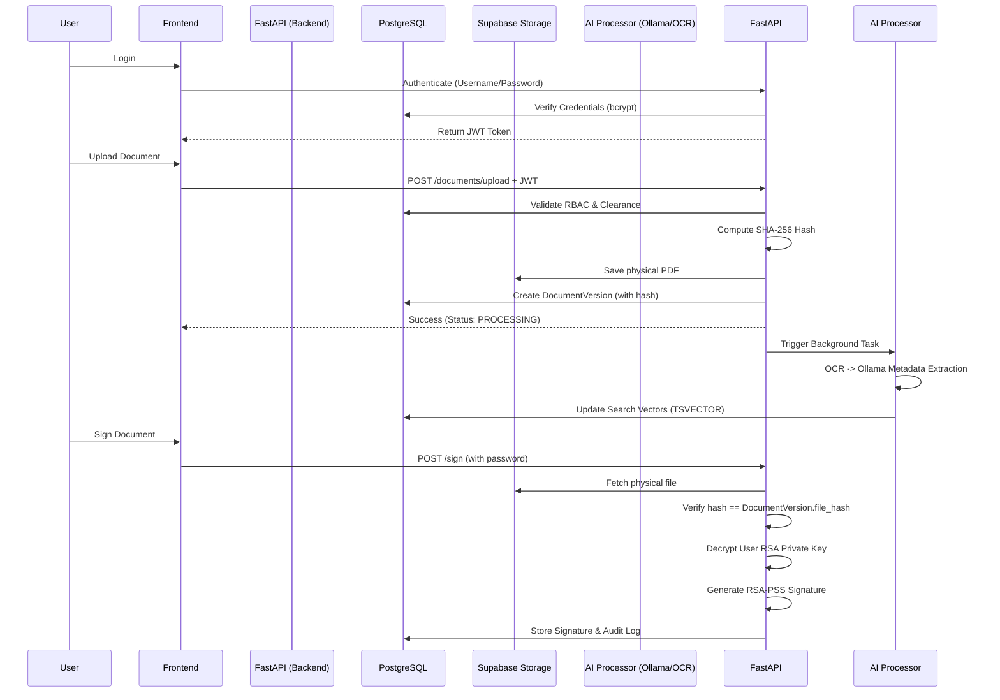

# Secure Digital Document Management System (DMS)

## 1. Project Overview

The Secure Digital Document Management System (DMS) is a centralized, high-security platform designed to digitize and manage the entire lifecycle of sensitive legal and investigative documents. Built for law enforcement agencies, courts, and legal departments, the system handles critical files such as FIRs, police reports, witness statements, and forensic evidence. 

Security is central to the architecture because the system manages highly sensitive data that demands strict confidentiality and evidentiary integrity. This is not a basic file-upload application; it is an integrated platform combining **Document Management**, **Case Management**, **Hierarchical Access Control (RBAC & Clearance Levels)**, **Full-Text Search**, **Document Integrity Verification**, **Version Control**, **Cryptographic Auditability**, and **AI-assisted Processing**.

## 2. Problem Statement

### SIH Background
Law enforcement agencies, courts, legal departments, and investigative organizations handle vast amounts of sensitive documents throughout the lifecycle of a case. Many organizations still rely on paper-based systems or fragmented digital storage solutions, leading to challenges such as:
- Difficulty in locating documents quickly
- Unauthorized access to confidential information
- Document tampering risks
- Lack of version control
- Inefficient collaboration between departments
- Delays in legal and investigative processes
- Poor auditability and compliance tracking

### The Engineering Challenge
A conventional file storage system (like Google Drive or a standard local file server) is inadequate for this domain because it lacks strict hierarchical access controls, cryptographic proof of integrity, and integrated legal workflows. The core challenges are:
1. **Fragmented document storage**: Data is scattered across isolated systems.
2. **Slow document retrieval**: Physical or disjointed digital systems make finding crucial evidence slow.
3. **Unauthorized access**: Lack of granular clearance levels leads to unauthorized data exposure.
4. **Document tampering**: Without cryptographic hashing and signatures, digital evidence can be silently altered.
5. **Lack of version control**: Hard to track how a document evolved over an investigation.
6. **Weak auditability**: Inability to cryptographically prove *who* accessed *what* and *when*.
7. **Evidentiary integrity**: Digital files must maintain chain-of-custody validity for court admissibility.

## 3. Our Proposed Solution

Our project transforms this problem by providing a centralized secure digital workflow. The end-to-end solution enforces security at every layer:

**User Login** (JWT Authentication) → **Authorization** (RBAC + Clearance) → **Case Access** (Assigned Ownership) → **Document Upload** → **Processing** (OCR & AI Extraction) → **Secure Storage** (Supabase) → **Search** (PostgreSQL FTS) → **Legal Workflow** (Review & Approval) → **Evidentiary Protection** (SHA-256 Hashing & RSA-PSS Signatures) → **Accountability** (Cryptographic Hash-Chained Audit Logs).

## 4. Problem-to-Solution Mapping

| SIH Problem | Our Solution | Implementation | Level of Resolution |
|---|---|---|---|
| Difficulty locating documents | PostgreSQL Full-Text Search + AI Metadata | TSVECTOR indexing and OCR-based text extraction. | Strongly addressed |
| Unauthorized access | Hierarchical RBAC + Clearance Levels | Backend JWT authorization + Case-level assignments. | Fully addressed |
| Document tampering | SHA-256 Hashing + Integrity Verification | `DocumentVersion` tracks `file_hash`; API re-verifies storage on demand. | Strongly addressed |
| Lack of version control | Immutable Document Versioning | `DocumentVersion` model tracks iterations with hashes. | Strongly addressed |
| Poor auditability | Hash-Chained Audit Logs | Backend `AuditLog` chains `previous_hash` with payload hashes. | Strongly addressed |
| Fragmented storage | Centralized Architecture | Supabase PostgreSQL (Relational) + Supabase Storage (Objects). | Fully addressed |
| Need for Authenticity | Cryptographic Digital Signatures | RSA-PSS with SHA-256 signatures tied to Document Versions. | Strongly addressed |
| Inefficient collaboration | Secure Sharing & Workflows | `ApprovalRequest` and `DocumentPermission` models. | Partially addressed |
| Delayed investigation workflows | AI-assisted structured extraction | Local Ollama AI extracts entities from OCR text. | Partially addressed |

## 5. Detailed Feature Explanation

### Authentication & Hierarchical Access
- **What problem does it solve?** Prevents unauthorized users from accessing sensitive case data.
- **How does it work?** Users authenticate via JWT. Authorization evaluates their Role (e.g., Investigating Officer, Admin), Clearance Level (1 to 5), and explicit Case Assignments.
- **Implementation**: Handled entirely server-side in `app.core.authorization` via FastAPI dependency injection.
- **Why is it appropriate?** Zero-trust architecture ensures the backend validates permissions on every request.

### Document Integrity & Hashing
- **What problem does it solve?** Detects silent tampering of digital evidence.
- **How does it work?** On upload, the backend computes a SHA-256 hash of the physical file and stores it in the database.
- **Implementation**: The `/verify-integrity` endpoint downloads the file from Supabase Storage, recalculates the SHA-256 hash, and compares it against the database record.
- **Why is it appropriate?** Provides mathematical proof if a file has been modified since it was uploaded.

### Document Versioning & Approval Workflows
- **What problem does it solve?** Maintains the historical evolution of investigation reports.
- **How does it work?** Documents maintain a status state machine (`READY` → `SUBMITTED` → `UNDER_REVIEW` → `APPROVED`). Updating a document creates a new immutable `DocumentVersion` with a new hash.
- **Implementation**: `DocumentVersion` and `ApprovalRequest` models manage the lifecycle.

### Hash-Chained Audit Logs
- **What problem does it solve?** Ensures accountability and prevents log manipulation.
- **How does it work?** Every critical action (View, Upload, Download, Login, Sign) is logged. Each log entry is cryptographically chained to the previous entry (`previous_hash` + payload = `current_hash`).
- **Implementation**: Evaluated via `GET /admin/audit-logs/verify-chain`, which recalculates the entire chain to detect DB-level tampering.

### Cryptographic Digital Signatures
- **What problem does it solve?** Provides non-repudiation and verifies the identity of the officer signing the document.
- **How does it work?** The backend provisions an RSA-2048 keypair per user, securely encrypting the private key via Fernet (`SECRET_KEY`). Officers authorize signing with their password. The system signs the document's SHA-256 hash using `RSA-PSS`.
- **Implementation**: `DocumentSignature` model and `/sign` endpoints in FastAPI.

### AI-Assisted Processing & OCR
- **What problem does it solve?** Makes scanned paper evidence searchable.
- **How does it work?** Uploaded PDFs are converted to images, OCR'd via Tesseract, and passed to a local Ollama model to extract structured metadata (entities, summaries).
- **Implementation**: A robust background task in `app.core.document_processing` with retry handling.

## 6. Authentication and Security Model

The security model operates on a strict **Zero-Trust** basis:
1. **Authentication**: Handled via stateless JWTs. Passwords are cryptographically hashed using `bcrypt`.
2. **Role-Based Access Control (RBAC)**: Defines actions (e.g., "Admin" can manage users, "Investigating Officer" can upload).
3. **Clearance Levels**: A hierarchical scale (1=Restricted to 5=Executive). A user cannot access a Level 4 document if they only possess Level 3 clearance, even if they have the correct Role.
4. **Case-Level Access**: Officers can only access documents belonging to Cases they own or have been explicitly assigned to.
5. **Horizontal Privilege Protection (BOLA/IDOR Prevention)**: Every API endpoint enforces backend authorization checks against the requesting user's identity before returning data.

## 7. Document Integrity and Evidentiary Protection

Evidentiary integrity is protected through **SHA-256** and **RSA-PSS**.
- **SHA-256**: The file is hashed immediately in memory upon upload. The hash represents the unique digital fingerprint of the file. It is stored immutably in `DocumentVersion`.
- **Integrity Verification**: When a user clicks "Verify Integrity", the backend fetches the file directly from the storage bucket, recalculates its hash, and compares it. This detects tampering. Note: This provides *tamper detection*, not *tamper prevention*.

## 8. Document Versioning and Legal Workflow

To preserve legal history, documents are never overwritten. 
Whenever an officer updates a document, a new `DocumentVersion` is created and the original remains intact. This establishes a clear chain of custody. The workflow allows officers to submit a specific version to a Senior Officer for approval, locking the document from further edits once approved.

## 9. Auditability and Accountability

The system maintains a comprehensive audit timeline for compliance and incident investigation.
- **Logged Actions**: VIEW, DOWNLOAD, UPLOAD, LOGIN, SHARE, PASSWORD_CHANGE, DOCUMENT_SIGNED, SIGNATURE_VERIFIED, UNAUTHORIZED_ACCESS_ATTEMPT.
- **Cryptographic Chaining**: The `AuditLog` table implements a tamper-evident blockchain-like data structure. Each row contains a `current_hash` derived from the event payload and the `previous_hash` of the preceding row. If a malicious database administrator alters a past log entry, the chain validation endpoint will immediately flag the chain as `BROKEN`.

## 10. Search and Retrieval

Fast and secure retrieval is powered by **PostgreSQL Full-Text Search (FTS)**.
- **Implementation**: The backend uses `to_tsvector` and `ts_rank` to execute highly optimized searches across document titles, metadata, and OCR-extracted content.
- **Authorization Filtering**: Search results are strictly filtered at the SQL query level. Users will only see search results for documents they have the clearance and case-assignment to view.
- **Distinction from AI**: Search relies entirely on PostgreSQL FTS. Ollama (AI) is used *only* during the upload phase to extract the metadata that populates the search index.

## 11. AI-Assisted Processing

- **Role of AI**: We use a locally hosted LLM (Ollama) to ensure sensitive legal documents never leave the secure environment (no third-party API calls).
- **Function**: Once OCR extracts raw text from a PDF, the AI structures it—identifying case entities, dates, and generating summaries.
- **Fallback**: If AI processing fails, the system falls back to standard text indexing and gracefully logs the failure for manual retry.

## 12. Storage and Database Architecture

The architecture leverages the **Supabase** ecosystem for robust separation of concerns:
- **Supabase PostgreSQL**: Acts as the primary relational database. The FastAPI backend interacts with it asynchronously via SQLAlchemy and `asyncpg`.
- **Supabase Storage**: Provides scalable object storage for physical PDF files. 
This separation ensures the database remains fast and lean, while physical files are stored in optimized buckets (`case_id/document_id/version.pdf`), secured by backend-proxied signed URLs.

## 13. Technology Stack — AND WHY EACH TECHNOLOGY WAS CHOSEN

1. **FastAPI (Python)**: Provides high-performance, asynchronous backend routing. Chosen for its automatic OpenAPI validation and native async support.
2. **React + Vite + TypeScript**: Powers the frontend UI. Chosen for strict type safety, fast build times, and responsive state management.
3. **Material UI**: Delivers a professional, accessible, and consistent component system without manual CSS overhead.
4. **PostgreSQL (via Supabase)**: The core relational engine. Chosen for its native Full-Text Search and JSONB support.
5. **SQLAlchemy + asyncpg**: Provides an asynchronous Object-Relational Mapping (ORM) layer, preventing SQL injection and managing complex schema relationships.
6. **JWT & bcrypt**: Industry standards for stateless authentication and secure password hashing.
7. **Tesseract / pdf2image**: Open-source OCR pipeline to convert scanned physical evidence into searchable text.
8. **Ollama**: Enables privacy-preserving, on-premise AI extraction without exposing confidential evidence to public cloud APIs.
9. **cryptography.hazmat**: Provides robust, low-level cryptographic primitives for RSA digital signatures and AES/Fernet key encryption.

## 14. Why This Architecture?

This architecture was selected to balance **Security**, **Performance**, and **Data Privacy**.
- **FastAPI + PostgreSQL** provides enterprise-grade throughput and strict typing.
- **Object Storage vs DB Blob Storage**: Storing PDFs in Supabase Storage rather than database blobs keeps the DB performant and reduces backup bloat.
- **Server-Side Authorization**: Enforcing permissions strictly on the backend prevents client-side bypass attacks.
- **Local AI**: Utilizing Ollama is a strict requirement for law enforcement to avoid violating data sovereignty laws by sending evidence to external APIs.

## 15. End-to-End System Flow

## 16. Security Threats Addressed

| Threat | Mitigation | Implementation |
|---|---|---|
| Credential compromise | Password hashing + Stateless JWT | `bcrypt` hashing in `app.core.security`. |
| Unauthorized document access | RBAC + Clearance + Case Authorization | `check_document_access` enforced on all routes. |
| IDOR/BOLA attacks | Server-side resource authorization | DB queries always filter by `current_user.id` relationships. |
| Document tampering | SHA-256 integrity verification | Physical file hashes compared dynamically on demand. |
| Audit repudiation | Hash-Chained Audit Logging | `previous_hash` chains prevent stealthy DB row modification. |
| Unauthorized search | SQL-level authorization filtering | `get_authorized_document_filter` applied to FTS queries. |
| Key Compromise | Symmetrical Server-side Key Encryption | RSA private keys encrypted at rest via `cryptography.fernet`. |

## 17. Testing and Verification

The system includes automated regression testing and manual validation workflows:
- **API & Access-Control Testing**: Automated Pytest suites ensure IDOR/BOLA protection, verifying that unauthorized roles are rejected with `HTTP 403 Forbidden`.
- **Cryptographic & Audit Chain Testing**: Extensive end-to-end Python test scripts (`test_crypto_audit.py`) automatically validate:
  - Successful generation and decryption of RSA keys.
  - Successful verification of intact digital signatures.
  - Rejection of signatures if the underlying file is intentionally modified.
  - Successful detection of broken audit chains when database records are intentionally corrupted.
- **Frontend Validation**: Manual validation confirms the UI securely reflects backend state, dynamically updating empty states and correctly rendering dynamic chip filters for newly introduced audit events.

## 18. What Problems Are Fully Solved vs Partially Solved?

### Strongly Addressed
- **Access Control & Confidentiality**: The hierarchical clearance and case-assignment architecture rigorously solves unauthorized access.
- **Evidentiary Integrity**: Cryptographic hashing and digital signatures provide mathematical proof of a document's authenticity.
- **Auditability**: Hash-chained audit logs ensure comprehensive, tamper-evident accountability.

### Partially Addressed
- **AI Processing**: The system successfully runs local OCR and LLM extraction, but accuracy depends heavily on the quality of the scanned inputs and the capabilities of the specific local Ollama model used.
- **Collaboration**: While documents can be assigned and submitted for review, a robust multi-agency federation system (sharing securely across different police departments) requires further development.

### Future Scope (Not Yet Implemented)
- **Blockchain**: While the audit log utilizes cryptographic chaining (the fundamental concept of a blockchain), the hashes are currently stored in a centralized PostgreSQL database. True decentralized ledger anchoring is a future integration.
- **Formal PKI/HSM**: User RSA keys are currently managed server-side. For legally binding signatures at a national level, integration with a Hardware Security Module (HSM) or a formal Public Key Infrastructure (PKI) provider is required.

## 19. Limitations

- **Local AI Throughput**: Processing large, multi-page PDFs through local OCR and Ollama models is computationally expensive and can introduce latency if many documents are uploaded concurrently.
- **Server-Side Key Management**: Storing encrypted private keys in the backend database places trust entirely on the backend architecture, making the server a high-value target.
- **Scaling Storage**: While Supabase Storage is robust, managing terabytes of high-resolution forensic images will require automated lifecycle management and tiering in the future.

## 20. Future Improvements

### Blockchain / Distributed Ledger Anchoring
The existing cryptographic audit chain can be elevated by periodically broadcasting the latest `current_hash` to a public or permissioned blockchain (e.g., Hyperledger). This anchors the internal database state to an immutable external ledger, making historical tampering mathematically impossible to hide.

### Hardware-backed Key Management (KMS)
Migrating from server-side encrypted RSA keys to a cloud KMS (Key Management Service) or physical HSMs (Hardware Security Modules) to guarantee private keys can never be extracted from memory.

### Advanced Chain of Custody Workflows
Implementing strict cryptographic hand-offs, where transferring a case between officers requires dual-signature authorizations to formally document evidence transfer.

### High Availability & Scalability
Migrating background document processing to a dedicated distributed message queue (e.g., Celery/Redis) to handle thousands of concurrent OCR/AI tasks horizontally across multiple worker nodes.

## 21. Expected Impact

Implementing this DMS dramatically modernizes legal and investigative workflows:
- **Retrieval Speed**: Instantaneous Full-Text Search replaces days of manual filing cabinet retrieval.
- **Security & Accountability**: Cryptographic audit trails deter internal misuse and provide definitive proof of compliance.
- **Document Integrity**: Digital signatures and hash verification eliminate disputes over evidence tampering in court.
- **Operational Efficiency**: Automated AI metadata extraction and digital approval workflows streamline administrative overhead, allowing investigators to focus on casework rather than paperwork.

## 22. Why This Solution Fits the SIH Problem

This project is directly engineered to solve the SIH mandate. It is not an "online file storage application"; it is an integrated **secure document lifecycle platform**. 

By unifying **Confidentiality** (Hierarchical RBAC), **Integrity** (SHA-256 & Digital Signatures), **Accountability** (Hash-chained Audit Logs), and **Intelligent Processing** (Local AI & FTS), the system provides a comprehensive, privacy-preserving digital vault tailored exactly for the sensitive operational realities of law enforcement and legal institutions. While future iterations can introduce decentralized blockchain anchoring and hardware PKI, the current foundation successfully delivers a highly secure, scalable, and intelligent platform for managing evidentiary data.
